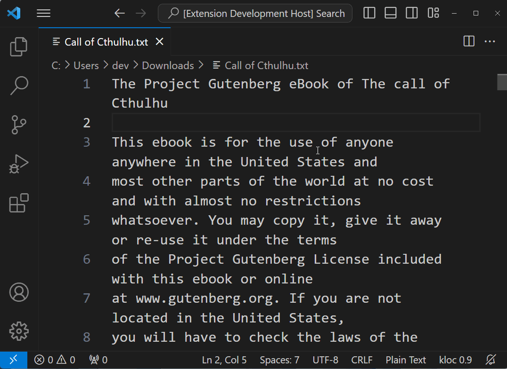

# kindle-loc README

A simple extension to display the kindle location for a text document. This project is cloned from [vscode-position](https://github.com/joerohde/vscode-position). 
When you put a text file into your Kindle, you can move the position of the text file via location, and this extension will help you find the exact location.

## Features

This extension displays the Kindle position of the cursor in the current text file in the bottom right status bar.
You can also click KLOC in the bottom right status bar to jump to the desired location.

## Requirements

No

## Extension Settings

No

## Known Issues

No

## Release Notes

### 1.0.0

Initial released.
